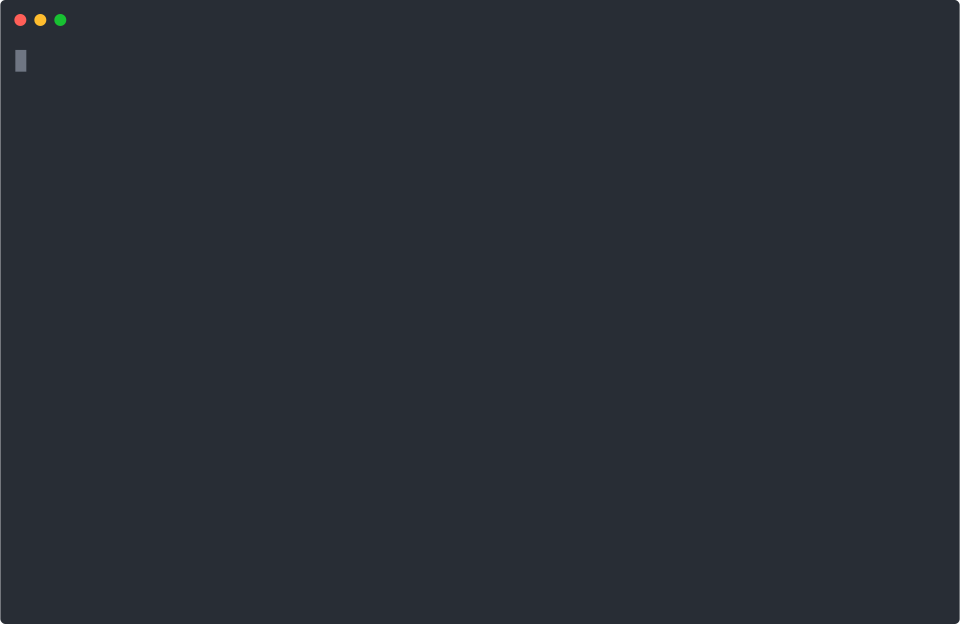

# okf-kit

[](https://github.com/vinodborole/okf-kit/actions/workflows/ci.yml)
[](https://pypi.org/project/okf-kit/)
[](https://pypi.org/project/okf-kit/)
[](LICENSE)
[](https://github.com/GoogleCloudPlatform/knowledge-catalog/blob/main/okf/SPEC.md)

**Turn any website into a portable, agent-ready knowledge bundle — no LLM required to start.**

<p align="center"></p>

`okf-kit` crawls a site into a
[Google Open Knowledge Format (OKF)](https://github.com/GoogleCloudPlatform/knowledge-catalog/blob/main/okf/SPEC.md)
bundle: a directory of markdown concept files with YAML frontmatter and
per-directory `index.md` listings that any agent can navigate with plain file
reads. Build it, keep it in sync as the site changes, publish it, and chat with
it — locally, with your own key, or fully offline via Ollama.

```bash
pip install okf-kit
okf build https://docs.example.com -o docs-okf   # crawl → OKF bundle (no key, no browser)
okf chat docs-okf --provider ollama              # chat offline, no key
```

Or zero-install with [`uv`](https://docs.astral.sh/uv/):

```bash
uvx --from okf-kit okf build https://docs.example.com -o docs-okf
```

Part of the **[calknowledge](https://github.com/vinodborole/calknowledge)**
ecosystem — okf-kit is the lightweight, open library; calknowledge is the full
platform (LLM enrichment, RAG export, retrieval evals, GUI) built on top of it.

---

## Why

Everyone re-crawls and re-indexes the same docs privately and badly. okf-kit
makes a website's knowledge a **portable artifact**:

- **Agents can read an OKF bundle; they can't read your website.** The bundle is
  navigable markdown — no scraping, no SDK, no runtime.
- **Faithful markdown, not text soup.** Real extraction (headings, code, tables),
  boilerplate filtered, JS-rendered when needed.
- **Self-maintaining.** `okf sync` updates only what changed, so a published
  bundle in git produces small delta commits and never goes stale.
- **Works with any LLM, or none.** Chat via OpenAI, Ollama, vLLM, OpenRouter, or
  Claude — or get a zero-key retrieval answer with citations.

## Install

```bash
pip install okf-kit                 # core: build / sync / validate / zip / list / get / visualize
pip install "okf-kit[chat]"         # okf chat via OpenAI-compatible providers (OpenAI, Ollama, …)
pip install "okf-kit[anthropic]"    # Claude as a chat provider
pip install "okf-kit[js]"           # crawl JavaScript-rendered sites (pulls a Playwright Chromium)
pip install "okf-kit[mcp]"          # serve bundles to Claude Code / Cursor over MCP
pip install "okf-kit[enrich]"       # okf build --enrich (LLM descriptions + tags)
```

The default install has **no browser and no LLM SDK** — it installs in seconds.

> **Tip:** install into a dedicated virtualenv so okf-kit's dependencies don't
> mix with your other projects:
> ```bash
> python3 -m venv ~/okf && ~/okf/bin/pip install okf-kit
> ```
> This also avoids clashes if an existing environment already pins packages
> like `lxml` (e.g. a prior `crawl4ai` install) — a plain install would
> otherwise bump them.

## Commands

### Build

```bash
okf build https://docs.example.com -o docs-okf --max-depth 3 --max-pages 200
```

Domain-restricted BFS crawl → an OKF bundle: `pages/` mirror with frontmatter
concepts, a `.okf-kit/state.json` for sync, and an `index.md` in every directory
for agent navigation. Validated on exit. No API key needed.

By default the crawl is **scoped to the seed's path section** — `okf build
https://doc.rust-lang.org/book/` stays under `/book/` and won't wander into the
rest of the host. Override with `--path-prefix PATH` (a narrower/different
scope) or `--all-paths` (the whole host). Other flags: `--js` (JS-rendered
sites — build hints when a site needs it), `--no-robots`, `--enrich` (add LLM
descriptions/tags — needs `[enrich]` + `OPENAI_API_KEY`).

### Sync

```bash
okf sync docs-okf
```

Re-crawls the same site and updates **only the delta** — added pages written,
changed pages rewritten, removed pages deleted, unchanged pages left
byte-for-byte (stable git diffs). A safety valve aborts on a suspiciously empty
re-crawl (`--force` overrides).

### Chat

```bash
okf chat docs-okf --provider ollama                 # offline, no key
okf chat docs-okf --provider openai --trace         # any provider, with citations + a navigation trace
okf chat docs-okf                                   # no provider → zero-key retrieval answer
okf chat docs-okf --resume                          # continue the last session (history is local)
```

The agent navigates the bundle (`list_directory` / `read_concept`) to the most
specific concept and answers **only from what it read**, citing the paths.

| `--provider` | Endpoint | Key |
|---|---|---|
| `openai` | OpenAI | `OPENAI_API_KEY` |
| `ollama` | `localhost:11434` (local) | none |
| `openrouter` | OpenRouter | `OPENROUTER_API_KEY` |
| `anthropic` | Claude | `ANTHROPIC_API_KEY` |
| `custom` | `--base-url` | as configured |

Chat history is stored locally at `~/.okf/chats/<bundle>/`.

### Visualize

```bash
okf visualize docs-okf          # -> docs-okf/graph.html
```

A self-contained interactive graph (nodes = concepts, edges = internal links);
no backend, no CDN — open the HTML from `file://`.

### Serve over MCP

```bash
okf serve-mcp docs-okf          # or --all for every downloaded bundle
```

Exposes `list_bundles` / `list_directory` / `read_concept` / `search_bundle` over
stdio MCP for Claude Code/Desktop, Cursor, and any MCP client.

**Or run it as a container** (the included `Dockerfile` bakes in the `rust-book`
bundle):

```bash
docker build -t okf-kit-mcp .
docker run -i --rm okf-kit-mcp   # speaks MCP over stdio; serve another bundle: … okf-kit-mcp okf serve-mcp <name>
```

### Serve a local API (for GUIs)

```bash
pip install "okf-kit[serve]"
okf serve                        # prints {"event":"ready","url":…,"token":…}
```

A loopback-only HTTP API that wraps registry / read / chat / settings, so a
desktop app or web UI can be pure UI over an API (no duplicated logic). Guarded
by a per-launch bearer token. Endpoints cover browsing the registry, installing/
removing books, reading (`toc` + `concept` with heading anchors), chat with saved
sessions and cited, deep-linkable sources, and settings (API key kept in the OS
keychain). Consume-only, so it stays light to bundle.

> **Built on this:** [**okf-desktop**](https://github.com/vinodborole/okf-desktop) —
> a lightweight desktop app (React + pywebview) that reads and chats with your
> bundles like a book, entirely over `okf serve`.

### Registry

```bash
okf list --remote               # browse published bundles
okf get backstage-docs          # download, validate, install to ~/.okf/bundles/
okf list                        # your local bundles
```

### Package for hand-off

```bash
okf zip docs-okf                # -> docs-okf.zip, ready to publish or share
```

## Publishing

See [docs/PUBLISHING.md](docs/PUBLISHING.md) — build a bundle, ship it as a
release zip with a weekly self-sync Action, and add it to the
[awesome-okf-kit](https://github.com/vinodborole/awesome-okf-kit) registry.
Publish only content you may redistribute.

## Bundle layout

```
docs-okf/
    index.md                 root directory listing (reserved, no frontmatter)
    log.md                   build/sync history
    pages/                   one concept per page (frontmatter + body + citations)
        index.md             directory listing (every directory has one)
        home.md
        docs/…
    .okf-kit/state.json      crawl config, per-page content hashes, link edges
```

## FAQ

**Does okf-kit require an LLM or API key?**
No. The entire build path — crawl, structure, validate — runs with zero API keys
and zero model calls. An LLM is optional: you only need one for synthesized
`okf chat` answers (use Ollama for fully offline) or the optional `--enrich` step.
With no model configured, `okf chat` still answers from a zero-key retrieval
fallback, with citations.

**What is OKF, and is okf-kit official?**
OKF (Open Knowledge Format) is an open, vendor-neutral spec for representing
knowledge as markdown files with a little YAML frontmatter (`type`, `title`,
`description`, `resource`, `tags`, `timestamp`), introduced by Google as part of
its Knowledge Catalog work. **okf-kit is an independent, unofficial**
implementation — and it interoperates: it validates and renders Google's own
reference bundles unchanged.

**How is okf-kit different from Google's OKF tools?**
Google's reference implementation targets BigQuery / data-catalog metadata with
an LLM enrichment agent. okf-kit targets **any website** with a deterministic
crawler that needs no LLM, no cloud, and no API key — and adds incremental sync,
offline chat, an MCP server, and a community registry. Same format,
complementary mission.

**Can I use it with Claude Code / Cursor?**
Yes — `okf serve-mcp <bundle>` is a stdio MCP server exposing `list_bundles`,
`list_directory`, `read_concept`, and `search_bundle`, so any MCP client can read
a project's up-to-date docs locally. There's also a Docker image.

**Does it work offline?**
Yes. Building a bundle needs network only to crawl the site once; after that it's
all local files. `okf chat` runs fully offline with Ollama, or with the zero-key
retrieval fallback.

**What sites can it crawl?**
Any static or server-rendered HTML site (docs, wikis, blogs). It respects
robots.txt and scopes the crawl to the seed's path by default. JavaScript-rendered
SPAs need the optional `[js]` extra (a real browser); extraction quality varies by
site.

## Development

`pip install -e ".[dev]"`, then `pytest -q` (fully offline) and
`ruff check okf_kit tests`. See [CONTRIBUTING.md](CONTRIBUTING.md) and the
[CHANGELOG](CHANGELOG.md).

## License

Apache-2.0.
